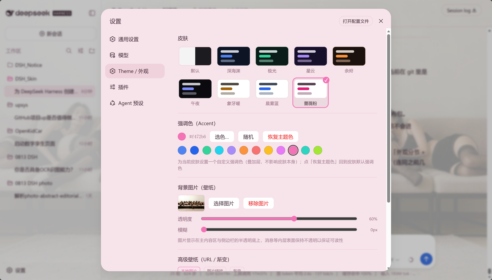
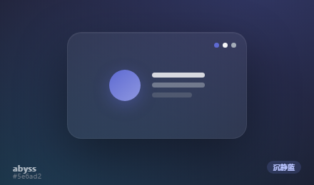
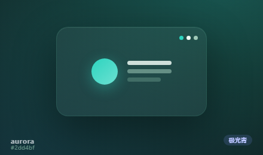
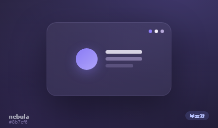
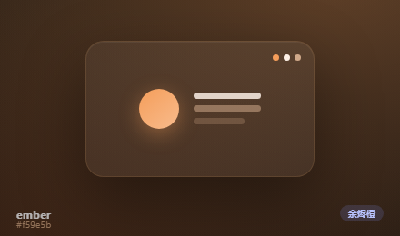
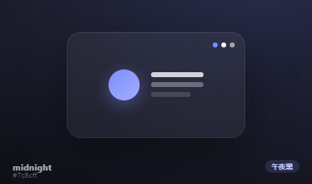
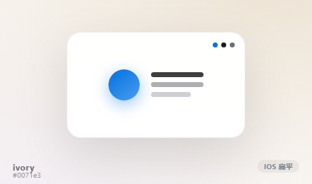
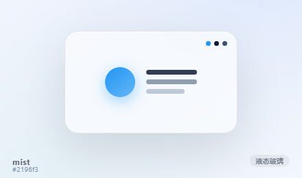
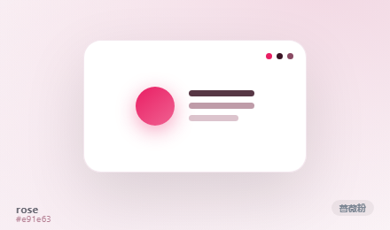

<p align="center">
  <a href="../../README.md">中文</a> · <a href="./README.en.md">English</a> · <a href="./README.ja.md">日本語</a> · <a href="./README.ko.md">한국어</a> · <a href="./README.es.md">Español</a> · <a href="./README.fr.md">Français</a> · <a href="./README.de.md">Deutsch</a> · <strong>Русский</strong>
</p>

<div align="center">

# dsh-dream-skin 🔮

**Подарите DeepSeek Harness облик, который будет сдержанным, чистым и текстурным.**

Нативные скины · обои · акцентный цвет · тематические пакеты для обмена — элегантная реализация, полностью
построенная на официальной системе токенов `--dsw-*` от DSH. Установите один раз — пользуйтесь вечно.

> **TL;DR: ваше рабочее пространство может быть спокойным.**

| 🎨 8 оригинальных тем | 🖼️ обои + рассеянное свечение | 🎯 сдержанный акцент | 📦 пакеты тем для обмена |
|---|---|---|

> Установка в одну строку · полностью нативный (без инъекций, без патчей установщика) · переживает обновления DSH

</div>

---

## 🎮 Два способа игры, один плагин

<table>
  <tr>
    <td align="center" width="50%"><h3>🪄 Способ №1: элегантно из коробки</h3></td>
    <td align="center" width="50%"><h3>🧱 Способ №2: DIY на ваших условиях</h3></td>
  </tr>
  <tr>
    <td>8 <b>пресет-скинов</b>, настроенных дизайнерами (серия Mirage), светлые и тёмные, каждый со своим фоном с рассеянным свечением.<br/><b>Наденьте любой — и он выглядит премиально, без настройки.</b></td>
    <td>Поверх любого пресета вы можете <b>сменить обои (локальные / URL / градиент)</b>, <b>наложить акцентный цвет Accent</b> или <b>импортировать и передать тематический пакет</b> — доступен каждый внутренний токен.<br/><b>Настраивайте как угодно.</b></td>
  </tr>
</table>

Оба способа слоисты и независимы: пресет определяет «материал и базовый тон»; DIY — чистое наложение
(`overrideTokens`), его можно включить/выключить и откатить в один клик.

---

## 📸 Скриншоты

> Настоящие скриншоты, а не макеты. Слева: DSH после применения скина; справа: выделенный раздел **Тема / Оформление** в настройках.

<p align="center">
  
  &nbsp;&nbsp;
  
</p>

---

## 🎨 Превью — серия Mirage

> **Способ №1 · элегантно из коробки.** 8 скинов ниже сгенерированы из **реальных токенов каждого скина + специального
> фона с рассеянным свечением** — что видите, то и получаете. Нажмите, чтобы увеличить и рассмотреть детали материала.

<table>
  <tr>
    <td align="center"><a href="../../docs/previews/abyss.png"></a><br/><b>abyss</b> · Deep Blue</td>
    <td align="center"><a href="../../docs/previews/aurora.png"></a><br/><b>aurora</b> · Aurora Green</td>
    <td align="center"><a href="../../docs/previews/nebula.png"></a><br/><b>nebula</b> · Nebula Purple</td>
    <td align="center"><a href="../../docs/previews/ember.png"></a><br/><b>ember</b> · Ember Amber</td>
  </tr>
  <tr>
    <td align="center"><a href="../../docs/previews/midnight.png"></a><br/><b>midnight</b> · Midnight OLED</td>
    <td align="center"><a href="../../docs/previews/ivory.png"></a><br/><b>ivory</b> · iOS Flat</td>
    <td align="center"><a href="../../docs/previews/mist.png"></a><br/><b>mist</b> · Liquid Glass</td>
    <td align="center"><a href="../../docs/previews/rose.png"></a><br/><b>rose</b> · Material Pink</td>
  </tr>
</table>

### 📋 Пресеты одним взглядом

| id | стиль | особенность |
|------|--------|------|
| `abyss` | 🕶️ Deep Blue | спокойный глубокий индиго, сдержанный и тихий |
| `aurora` | 🌌 Aurora Green | чёткий полупрозрачный холодный бирюзовый, естественный холодный тон |
| `nebula` | 🪐 Nebula Purple | глубокий рассеянный сине-фиолетовый, туманный и загадочный |
| `ember` | 🔥 Ember Amber | тёплый сдержанный янтарно-оранжевый |
| `midnight` | 🌚 Midnight OLED | минималистичный чистый чёрный, погружающий OLED |
| `ivory` | 📐 iOS Flat | минималистичный плоский белый, системный серый iOS + сдержанный синий |
| `mist` | 🧊 Liquid Glass | чистое матовое стекло, полупрозрачное + размытое |
| `rose` | 🌸 Material Pink | яркий насыщенный розовый, плоские цвета Google Material |

---

## 🧱 Серьёзное DIY-пространство (Способ №2)

> Помимо пресетов, dsh-dream-skin даёт вам полную систему кастомизации — начните здесь, чтобы создать рабочее
> пространство, которое будет уникально вашим.

| Возможность | Что вы можете сделать |
|------|------|
| 🖼️ **Обои 2.0** | Локальное изображение / **URL изображения** / **пресеты градиентов**; плюс **прозрачность / размытие**; каждый скин даже **предлагает** градиент и может **автоматически затемняться** (снижает отвлекающие факторы при фокусировке) |
| 🌈 **Индивидуальный Accent** | Наложите фирменный акцент поверх активного скина (слой `overrideTokens`, сам скин не затрагивается): **12 пресетов в один клик**, палитра цветов, рандомизация и опция очистки/восстановления |
| 📦 **Импорт / экспорт / обмен тематическими пакетами** | `*.dsh-theme.json` = манифест + полные токены. Импортируйте файл, применяйте в один клик или копируйте **ссылку для обмена** (закодирована в хэше URL) |
| 🪟 **Прозрачность всплывающих окон** | Ползунок, управляющий прозрачностью заливки выпадающих списков / оверлеев / диалогов, сохраняется |
| 🧩 **Локальная библиотека пакетов** | Ваши импортированные пакеты в одном месте; **применить / добавить в избранное / удалить** в один клик |
| 🎲 **Удиви меня** | Случайное переключение на другую тему; **отмечайте избранное звёздочкой**, чтобы быстро переключаться |
| ✅ **Проверка + откат** | Импорт пакета проверяет формат / обязательные токены / корректность цветов; при сбоях или удалении — безопасный откат |

> Всё наслаивается поверх пресета: **включайте/выключайте и возвращайтесь к встроенному виду DSH в один клик** —
> смело экспериментируйте, ничего не сломается.

---

## ⚡ Установка одной строкой

**Скопируйте это предложение в свой DSH, и он установит всё за вас:**

> Пожалуйста, установите плагин скинов dsh-dream-skin (https://github.com/RevolutionLA/dsh-dream-skin или npm-пакет `dsh-dream-skin`), затем расскажите мне, как перезапустить DSH Web.

Предпочитаете CLI? Одна команда:

```sh
dsh plugin --profile web add dsh-dream-skin && dsh web
```

> 🚀 **Теперь на npm!** Если DSH установлен, добавьте его одной командой — клонирование не требуется.

> **Дань уважения [Codex-Dream-Skin](https://github.com/Fei-Away/Codex-Dream-Skin).** Но подход другой:
> Codex внедряет CSS в рендерер десктопного клиента через CDP, тогда как DSH — это **Web GUI на токенах**, который
> из коробки поддерживает «сторонние плагины, регистрирующие темы». Поэтому этот плагин **полностью нативный** —
> без инъекций, без бинарных патчей, и он не сломается при обновлениях клиента.
>
> **Не официальный продукт.** Просто способ принарядить ваше рабочее пространство DeepSeek Harness.

---

## 🏆 Почему он заслуживает звезду (сравнение с альтернативами)

| Возможность | У нас | Другие DSH-скининг-решения | Codex-Dream-Skin (desktop) |
|------|:---:|:---:|:---:|
| Нативные темы на токенах — без инъекций, без патчей установщика | ✅ | ✅ | ❌ (инъекция через CDP) |
| **Прохладный полупрозрачный материал и цвет в стиле iOS/Linear** | ✅ | ❌ (в аниме-стиле) | ❌ |
| **Сдержанное премиальное рассеянное свечение для каждого скина** | ✅ | частично | ❌ |
| Свои обои + прозрачность/размытие | ✅ | частично | ✅ |
| **Импорт/экспорт тематических пакетов + ссылки для обмена** | ✅ | ❌ | ✅ (zip-пакеты) |
| **Индивидуальное переопределение Accent** | ✅ | ❌ | частично |
| **Обои 2.0 (URL / градиент / предложение для каждого скина / авто-затемнение)** | ✅ | ❌ | ✅ |
| Локальная библиотека пакетов + избранное + «удиви меня» | ✅ | ❌ | частично |
| Проверка + откат | ✅ | частично | ✅ |
| **Web GUI в браузере, нативная кроссплатформенность** | ✅ | ✅ | ❌ (нужно десктопное приложение) |

---

## ✨ Возможности

| Возможность | Описание |
|------------|-------------|
| 🎨 **8 встроенных пресетов (Mirage)** | Мгновенное переключение в **Настройки → Тема / Оформление**, светлая и тёмная |
| 🖼️ **Свои обои** | Выберите локальное изображение (автосжатие ≤2MB), настройте **прозрачность / размытие** |
| 🔤 **Непрозрачные внутренние поверхности** | Карточки, поля ввода и пузыри сообщений остаются читаемыми — никогда не выцветают |
| ↩️ **Восстановление по умолчанию** | Возврат к встроенному виду DSH (следовать системе) в один клик |
| 💾 **Локальное сохранение** | Скин и обои хранятся в `localStorage`, переживают перезагрузку |

---

## 🧩 Что это за плагин

**Стандартный «двуликий» `dsh-plugin` в духе «всё является плагином» — загружается и используется точно так же, как официальный пакет `ui-theme`.**

Девиз DeepSeek Harness — *всё является плагином*: модели, инструменты, песочницы, сессии, интерфейс и даже сам
Agent Loop — это плагины. `dsh-dream-skin` поставляет скины как npm-пакет, **изоморфный официальным UI-пакетам**:

```text
            ┌──────────── dsh-dream-skin (standard dsh-plugin / dual-face) ─────────────┐
            │  dsh.bundle   → cordis.patch.yml inserts the dream-skin entry  (host half)│
            │  dsh.client   → lib/client.js (browser bundle)                (browser half)│
            └───────────────────────────────────────────────────────────────────────────┘
```

- **Команда установки = официальная**: `dsh plugin --profile web add dsh-dream-skin`
- **Использует официальные точки расширения**: `ctx.theme` (регистрация тем), `ctx.theme.overrideTokens` (слои
  переопределения), `ctx.slots` (монтирование UI в выделенный раздел **Настройки → Тема / Оформление**).
- **Контракт манифеста совпадает с официальными пакетами**: `dsh.bundle` + `dsh.client` + `exports["./client"]`.

Иными словами: вы устанавливаете не сомнительный скрипт — это стандартный плагин скинов внутри официальной
системы плагинов DSH.

---

## ⚡ Быстрый старт (3 шага)

```sh
# 1. установка
dsh plugin --profile web add dsh-dream-skin
# 2. перезапуск
dsh web
# 3. откройте Настройки → Тема / Оформление → выберите скин → готово.
```

> Устанавливает опубликованный npm-пакет — без клонирования. Если `dsh plugin add` сообщает об ошибке workspace, добавьте `-w`.

## 📦 Установка

Выберите любой из четырёх вариантов, затем **перезапустите DSH Web** (текущая сессия будет прервана, но сессии DSH
сохраняются на диск и восстанавливаются после перезапуска).

### Вариант A: Из npm (опубликован, **рекомендуется**)

```sh
dsh plugin --profile web add dsh-dream-skin
```

### Вариант B: Из GitHub (привязан к проверенному коммиту)

```sh
dsh plugin --profile web add 'github:RevolutionLA/dsh-dream-skin#<40-char-commit>'
```

> Привязка к коммиту релиза означает, что новые изменения в `main` никогда незаметно не изменят вашу установленную копию.

### Вариант C: Из tarball-архива релиза (офлайн / без git)

Скачайте `dsh-dream-skin-<version>.tgz` со страницы [Releases](https://github.com/RevolutionLA/dsh-dream-skin/releases)
(в архиве уже собранный `lib/client.js`, поэтому при установке не выполняется prepare-скрипт), затем:

```sh
dsh plugin --profile web add ./dsh-dream-skin-<version>.tgz
```

### Вариант D: Клонировать и установить из локального пути (для разработки)

```sh
git clone https://github.com/RevolutionLA/dsh-dream-skin.git
cd dsh-dream-skin
dsh plugin --profile web add .
```

> `dsh plugin` привязывает относительные пути к каталогу, **в котором вы выполняете команду**, устанавливая link-зависимость,
> указывающую на ваш клон: редактируйте исходники, сохраняйте, перезапускайте DSH — переустановка не нужна.

**Перезапустите и проверьте:**

```sh
dsh web
dsh --profile web --dump-config | grep -A2 dream-skin   # должна появиться запись загрузчика dream-skin
```

Откройте **Настройки → Тема / Оформление**, чтобы увидеть строки **Скины**, **Accent**, **Обои** / **Расширенные обои** и **Тематические пакеты**.

> Флаг `-w` (workspace) нужен при обычном `add`, потому что каждый профиль поставляется с `pnpm-workspace.yaml`; pnpm
> считает каталог профиля корнем workspace, поэтому обычный add завершается ошибкой `ERR_PNPM_ADDING_TO_ROOT`. Если ваш
> профиль уже использует workspace, повторять флаг не нужно.

## 🔄 Обновление / Удаление

**Обновление до последней версии** (если установлено из npm-релиза):

```sh
dsh plugin --profile web update dsh-dream-skin
dsh web   # перезапустите, чтобы применить
```

> Застряли на старой версии после обновления? Политика pnpm minimum-release-age (supply-chain) может удерживать
> свежеопубликованный релиз. В каталоге профиля выполните:
> `pnpm add dsh-dream-skin@latest --config.minimumReleaseAge=0`, чтобы принудительно обновиться.

**Удаление:**

```sh
dsh plugin --profile web remove dsh-dream-skin
dsh web   # восстанавливает официальный вид
```

---

## 🧩 Совместимость

| Элемент | Значение |
|------|-------|
| DeepSeek Harness (`dsh`) | **Одна сборка для двух поколений хоста**: стабильная `0.1.0-rc.6` / `0.1.1-rc.x` (peerDependencies привязаны к `^0.1.0-rc.6`) и DSH master (таблица модулей после разделения) |
| Node.js | `>=18` |
| Браузер | современный Chromium / WebKit (нативные CSS-переменные и `matchMedia`) |

> При обновлении DSH поднимите peerDependencies в `package.json` соответствующим образом.

---

## ⚙️ Как это работает

Тематическая система DSH основана на токенах: веб-оболочка поставляет дизайн-токены `--dsw-*`, а `ThemeRuntime` позволяет
сторонним плагинам регистрировать темы, переопределяющие слой алиасов (`--dsw-alias-*`). Этот пакет — стандартный «двуликий» плагин:

```text
                ┌─────────────────────────────────────────────┐
                │          dsh-dream-skin (dual-face plugin)    │
                ├────────────────────────────┬────────────────┤
    Host half   │  lib/index.js              │  Browser half  │
                │  cordis.patch.yml inserts  │  lib/client.js │
                │  dream-skin loader entry   │  __ModuleLoader__│
                └────────────────────────────┴────────────────┘
                             │                         │
                     profile tree loaded      /plugins/dsh-dream-skin/client.js
                                                           │
        ┌────────────────────────────────┬────────────────┐
        │                                │                │
   ctx.theme.register(8 skins)     ctx.theme.overrideTokens(wallpaper)   ctx.slots.inject('settings.section' + 'settings.dreamSkin.item')
```

- **Хост-часть** (`lib/index.js`) — слой патча `dsh.bundle`, вставляющий запись загрузчика `dream-skin`; `apply` —
  no-op, точно как в поставляемых пакетах `ui-*`.
- **Браузерная часть** (`lib/client.js`):
  1. регистрирует 8 скинов через `ctx.theme.register(...)`;
  2. восстанавливает сохранённый скин и применяет его с помощью `ctx.theme.setTheme(...)`;
  3. рендерит обои как фиксированный фон с `z-index:-1` и накладывает `ctx.theme.overrideTokens(...)`, делая
     основное полотно (`--dsw-alias-bg-base`) и боковую панель (`--dsw-specific-sidebar-fill`) полупрозрачными;
  4. слушает событие `theme/change` и перекрашивает подложку обоев при переключении скина / схемы;
  5. регистрирует выделенный раздел **Настройки → Тема / Оформление** (`settings.section`) и монтирует пять
     строк возможностей в слот `settings.dreamSkin.item`.

Каждый скин несёт свой `colorScheme` (`light`/`dark`), управляющий `body[data-ds-dark-theme]`; переопределения
токенов-алиасов применяются как инлайн-кастомные свойства на `<body>` через ThemePresenter из ui-layout.

## 💼 Заметки о сохранении

- Скин и обои хранятся в `localStorage` (ключи с префиксом `dsh-dream-skin:`), **для каждого браузера**.
- Почему не настройки Host? Проводка настроек Host раскрывает браузерным клиентам только список разрешённых
  namespace (`WEB_SETTINGS_NAMESPACES` в `dsh-host-apiproxy`), поэтому сторонний namespace получил бы ответ
  `settings-not-exposed`; сам продукт хранит удалённые браузерные предпочтения локально в процессе. `localStorage`
  соответствует этой границе и переживает перезагрузки.

---

## 🛠️ Разработка / расширение тем

Клиентский бандл написан напрямую в формате `__ModuleLoader__` (та же форма, которую tsdown выдаёт для поставляемых
пакетов `ui-*`), поэтому **шаг сборки не требуется**. `lib/client.js` может `require` только сущности таблицы модулей:
платформенные сиды (`react`, `react/jsx-runtime`, …) и зарегистрированные клиентские бандлы (`@deepseek-ai/dsh-client-runtime/client`, …).

- **Добавить встроенный скин**: добавьте объект (`id` + `colorScheme` + `tokens`) в массив `SKINS` в `lib/client.js`;
  он автоматически появится в настройках. Добавьте ключ `skin.<id>` во **все 8 словарей локалей**
  (`zh`/`en`/`ja`/`ko`/`es`/`fr`/`de`/`ru`).
- **Выпустить тематический пакет (рекомендуется)**: следуйте [`docs/examples/sample-theme-pack.json`](../../docs/examples/sample-theme-pack.json) —
  один файл `*.dsh-theme.json` можно импортировать в настройках и передавать по ссылке, без изменений кода.
- **Добавьте свои обои**: поместите изображения в [`wallpapers/`](../../wallpapers/) (распространяйте только то, на что
  у вас есть права), затем импортируйте их через строку «Обои» в DSH.
- **Перегенерировать превью**: превью генерируются скриптом `scripts/generate-skin-mockups.cjs` (реальные токены +
  рассеянное свечение) в HTML-макеты, затем захватываются как `docs/previews/*.png` с помощью headless Chrome —
  перезапустите его после изменения токенов скина, чтобы превью соответствовало реальному скину.
- **Проверка**: `npm test` (дымовые тесты в VM, покрывающие factory eval, `apply()` и импорт/сохранение пакетов).
- **Перекраска**: используйте токены `--dsw-alias-*` (полный контракт в [`docs/themes-spec.md`](../../docs/themes-spec.md)).

## 📌 Дорожная карта

- [x] v0.1: 8 тем + свои обои (прозрачность / размытие) + локальное сохранение
- [x] Формат тематического пакета + импорт / экспорт / ссылка для обмена (JSON + манифест + проверка)
- [x] Индивидуальный Accent + рандомизация
- [x] Обои 2.0 (URL / градиент / предложение для каждого скина / авто-затемнение)
- [x] Локальная библиотека пакетов + применение в один клик / избранное / «удиви меня»
- [x] Полная i18n-локализация и документация (zh / en / ja / ko / es / fr / de / ru)
- [ ] Онлайн-студия палитр / превью тем (чистый фронтенд, проверка контраста)
- [ ] Галерея тем сообщества (отправка пакетов в репозиторий / онлайн-галерею)
- [ ] Улучшение первой отрисовки (FOUC)

---

## 🤝 Вклад в проект

Приветствуются Issues и PR! Пожалуйста, прочитайте [Руководство по вкладу](../../CONTRIBUTING.md) и следуйте
[Кодексу поведения](../../CODE_OF_CONDUCT.md).

## ⭐ Поддержка проекта

Если он вам нравится: поставьте звезду **⭐** репозиторию, лайк **👍** на npm или поделитесь с друзьями по DSH —
это помогает проекту находить аудиторию и оставаться поддерживаемым. Хотите внести вклад темами / онлайн-студией /
новыми скинами? Присоединяйтесь.

## 🔒 Безопасность

Нашли проблему безопасности? Не открывайте публичный issue — см. [Политику безопасности](../../SECURITY.md).

## 📄 Лицензия

[MIT](../../LICENSE)

## 🙏 Благодарности

- Справочник по архитектуре и API: официальный клиентский пакет DeepSeek Harness
  [ui-theme](https://github.com/deepseek-ai/deepseek-harness/tree/master/packages/client/ui-theme).
- Концептуальная дань: [Codex-Dream-Skin](https://github.com/Fei-Away/Codex-Dream-Skin).

---

## 📈 Кривая роста

> Автоматически обновляется ежедневно (GitHub Actions). Левая ось: **суммарные скачивания** (бирюзовый); правая ось: **число звёзд** (фиолетовый) — сильно разные порядки величин, поэтому у каждого своя независимая ось Y.

<p align="center">
  
</p>

*Данные собираются каждые 24 часа: скачивания — из [официального API npm](https://api.npmjs.org/downloads/range/2026-08-15:2026-12-31/dsh-dream-skin), звёзды — из [API GitHub](https://github.com/RevolutionLA/dsh-dream-skin/stargazers).*
